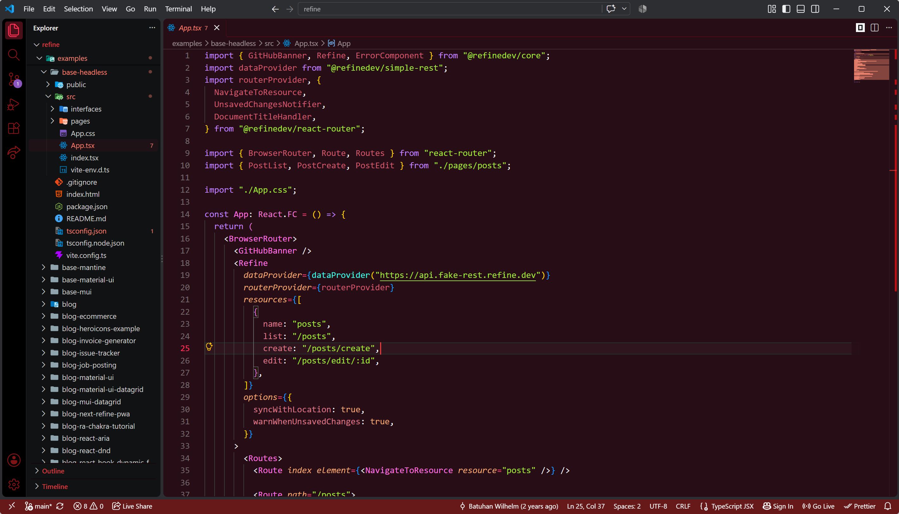
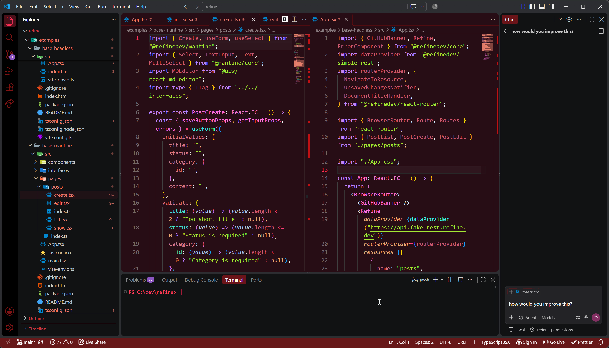
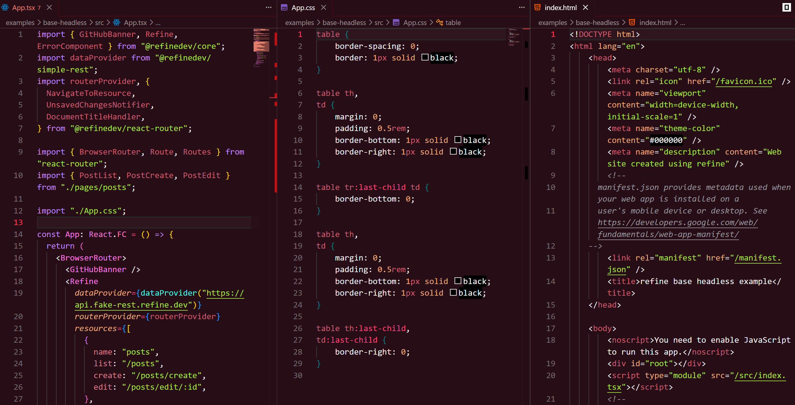

# Vesper Noir

A dark Visual Studio Code theme built around black, charcoal, burgundy, and muted crimson.

Vesper Noir began with a simple idea: **black and burgundy look damn good together.**

As the palette developed, the theme naturally took on a darker character — gothic architecture, candlelit interiors, deep wine reds, and a distinctly vampiric atmosphere. Rather than fight that direction, Vesper Noir embraces it.

The result is a dark, low-glare theme with a strong visual identity, while keeping the editor itself practical and readable for everyday development.

---

## Preview

---

## The Palette

Vesper Noir revolves around a restrained combination of:

- Deep black and charcoal backgrounds
- Burgundy as the dominant accent
- Muted crimson and wine-red highlights
- Soft neutral foreground colors
- Carefully separated syntax colors without turning the editor into a rainbow

The goal is atmosphere without sacrificing usability.

It is unmistakably dark, but not simply _black with red text everywhere_.

---

## A Gothic Workspace

The theme extends beyond the editor itself. Sidebars, tabs, selections, borders, terminal surfaces, status elements, and other interface components are designed to feel like parts of the same environment.

The gothic and vampiric character is deliberate, but the theme avoids turning VS Code into a novelty interface. The aesthetic comes primarily from the palette, contrast, and atmosphere.

---

## Syntax

Vesper Noir is designed around modern web development, with particular attention paid to JavaScript, TypeScript, React, HTML, CSS, and related tooling.

Syntax highlighting stays within the overall identity of the theme while providing enough variation to distinguish different parts of the code at a glance.

---

## Why "Vesper Noir"?

**Vesper** evokes evening and the arrival of night.

**Noir** reflects the theme's overwhelmingly dark foundation.

Together, the name fits what the theme eventually became: something darker, more gothic, and a little vampiric — without needing to plaster bats and fangs over the editor itself.

---

## Installation

1. Open **Extensions** in Visual Studio Code.
2. Search for **Vesper Noir**.
3. Install the extension.
4. Open the Color Theme picker.
5. Select **Vesper Noir**.

Enjoy the night.
